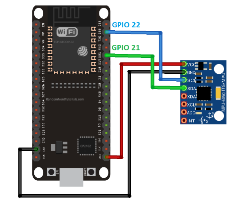

# CSC 591/791, ECE592/792

Spring 2022

## Homework Assignment # 3

### Objectives

Get hands-on experience working with analytics tools and cloud platform using real sensors

### Description

In this assignment, you will develop an inertial measurement unit (IMU) and cloud based system that will identify door
open and door close events. You will attach the IMU sensor to a door, and use values from the IMU to determine when it
has been closed and opened.
An IMU usually comprises a 3-axis analog gyro and a 3-axis accelerometer. Here is a link to
one: http://www.amazon.com/gp/product/B008BOPN40. IMUs are primarily used to sense and measure motion. The phones use
them, for example, to switch screen orientation when you rotate the phone. Search online and you will find several
tutorials on what an accelerometer and a gyro are and how to use them programmatically.

You will attach the IMU sensor to a door, and interface the IMU sensor with an IoT device (any IoT device of your
choice, such as a Raspberry Pi, Beaglebone, Arduino etc.), which will collect the values from the sensor. You will run a
classification algorithm, either locally on the IoT device or in the cloud service, whichever you prefer, that will
monitor the values it receives from the sensor. Whenever the door is opened or closed, the classification algorithm
should automatically identify whether the door has been opened or closed, respectively. The cloud service should receive
this decision from the IoT device (unless, you run the classification algorithm in the cloud, in which case, the cloud
service will receive the classification decision from your classification algorithm running in the cloud) and then send
this decision to an application running on your personal device (can be a laptop or smart phone). This application will
continuously show the current status of the door (i.e. whether the door is closed or open).

For the classification technique, you can use support vector machines. I will recommend that you use the libSVM
implementation (https://www.csie.ntu.edu.tw/~cjlin/libsvm/). As IBM Cloud has a python runtime, if you choose to run
your classification algorithm on the cloud, you can port the python version of libSVM to IBM Cloud. You are free to use
any other classification algorithm/method if you choose not to use SVM. The communication protocol between the IoT
device and the IBM Cloud must be MQTT. IBM Cloud supports MQTT. The decision on each door opening and closing must be
sent to a laptop/smart phone. Both the IoT device and the laptop/smartphone will be MQTT clients. IoT device will be
publisher; laptop/smartphone will be subscriber. The laptop/smart phone should show the current status whether the door
is opened or closed. Every time a new door open/close event is detected by the cloud service and pushed to the
laptop/smart phone, the laptop/smart phone should update the decision it is showing to the user and also show the time
of latest decision.

For the classification scheme to work, you will need training instances. To collect training instances, you will attach
the IMU to a door. The height of the sensor does not matter but distance from the hinge may. I would suggest that you
refrain from attaching the IMU at the opening edge of the door because if you collect all your training data from the
edge of a door, your scheme may not work on another door with different size. You are free to require the door to be
moved by a certain angular distance before making a decision. For example, your implementation may require that the door
must be opened by at least 45 degrees to detect and recognize an open event. Similarly, when closing the door, you can
say that your implementation can detect and recognize a door close only when the door moves by at least 20 degrees etc.
Your choice! But make sure that one motion of door opening is recorded as one door open event not multiple. Same applies
to door closing. For example, if you require the door to be closed by at least 20 degrees to detect a door close event,
but if you move the door by 70 degrees in one go, then that should be detected as a single door close event, not 3 door
close events.

### Demo

The demos will be conducted around the submission deadline. You will schedule a time-slot for the demo with the TA. The
demos can be conducted in-person or via Zoom, whatever you prefer. In the demo, following things will be done:

Before starting the demo, you will set up your IMU. You will attach your IMU (and IoT device if you like) to the door
using tape, or any method you prefer. The TA will provide you with a sequence of door opens and door closes. You will
open and close the door in that sequence. After every door open/close, you willtell the TA that you are done, and then
the TA will record the decision being shown on the laptop/smartphone (you will share that laptop/smartphones screen
during the meeting) along with the time of the decision. Note that it is possible that you close the door and your
laptop/smartphone is also showing the status as "close", but that decision was an old decision, and no new decision was
posted when the door is closed. In that case, this door close event is not correctly classified (or not classified at
all) and will be marked as incorrect classification. The sequence will have 20 door opens and closes (almost half will
be door open events and half will be door close events). The sequence may look something like this: Open, Open, Close,
Open, Close, Close... etc. Note that the first two steps are: Open followed by Open. In this case, to execute the first
door open, you will open the door, the TA will record the decision your laptop/smartphone shows. Then you will close the
door. The TA will not record the decision whenclosing the door. Then to execute the second door open, you will again
open the door and the TA will record the decision your laptop/smartphone shows. Then you will close the door to execute
the third item in the sequence, which is door close, and the TA will record the decision. A major part of your grade
will depend on the percentage of correct decisions among the 20 door opens and closes. Your code shoulda utomatically
determine (using the values from IMU) when a door movement starts and when it ends. You should not have to manually tell
your code when the door movement starts and when it ends.

During the demo, you will also provide to the TA the link that IBM cloud gives you that shows your cloud project
webpage. Through that webpage, you will show the TA that the values are indeed being received from the IoT device to the
cloud platform. For this, on the webpage of your Cloud project, you should incorporate some information such as the
values being received from IoT device along with their time stamps, and decisions being sent to the subscriber
laptop/smartphone.

### What to submit

Each team must upload the following:

1. Code for laptop/smartphone and a detailed readme file explaining how to execute the code
2. Code for IoT device and a detailed readme file explaining how to execute the code
3. A document providing an overview of how your entire system works. The document should further include schematics
   diagram of connection of the IoT device with the sensor, explanation of your feature extraction and selection
   methods, and explanation of your classifier training method.
4. A document containing names of each team member, what each team member did, and percentage contribution of each team
   member.

# Solution

### Wiring diagram for ESP32



### ESP32 firmware

The firmware for ESP32 was implemented in 2 languages: Arduino C and MicroPython.

#### MicroPython

To implement MicroPython code follow this [link](https://docs.micropython.org/en/latest/esp32/tutorial/intro.html) to
flash ESP32 with the newest micropython firmware. Install [Thonny IDE](https://thonny.org/). Choose MicroPython (ESP32)
in the lower right dropdown menu. Copy all the files from the folder `HW4/ESP32 firmware/micropython` to
microcontroller.

Press stop button in Thonny IDE and the code starts working.

#### Arduino C

To implement Arduino C code install [Arduino IDE](https://www.arduino.cc/en/software) and follow
this [link](https://randomnerdtutorials.com/installing-the-esp32-board-in-arduino-ide-windows-instructions/) to setup
Arduino IDE to work with ESP32. Open
file `HW4/ESP32 firmware/Arduino C/Assigment_4_publish_to_broker_threshold/Assigment_4_publish_to_broker_threshold.ino`.
Before uploading to ESP32, install all the required libraries listed in the begining of the code by going
to `tools > manage libraries > search specific library`. Once all the libraries have been installed, replace the network
credentials to your credentials and press `Upload`. Once the firmware is flashed, press enable button on the ESP32 board
to start measuring IMU values and publishing them to the broker.

### ML model script

ML_client.py runs in cloud. It was implemented on AWS EC2 Cloud9 IDE. Simply copy this file and
file `finalized_model.sav` to virtual machine and run it:

```
python ML_client.py
```

### Door status Client

To run the client you have to run the `subscriber.py` script. cd to the HW4 folder and execute the script, e.g.:

```
cd IOT_IOT_ASSIGNMENT_2/HW4
python3 subscriber.py
```

Type your client ID and wait for the messages to appear.
Press Enter to quit.
