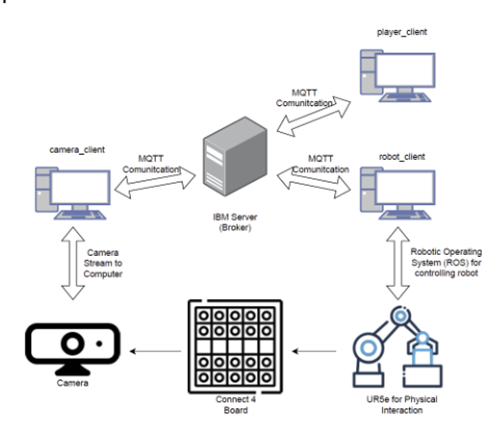
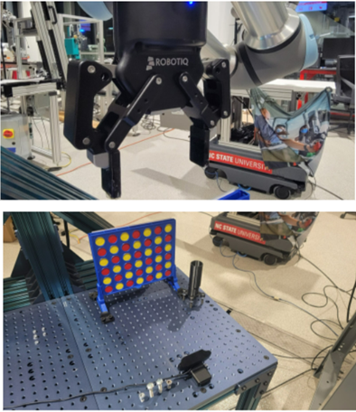

### Connect4 game with Robot MQTTClient

This framework consists of 3 MQTT clients that need to be running. RobotClient is controlling the Robot arm and performs
physical interaction of PlayerClient. CameraClient is reading the game board and sends the data to the broker, whereas
PlayerClient and RobotClient are subscribed to it.

# System Architecture

